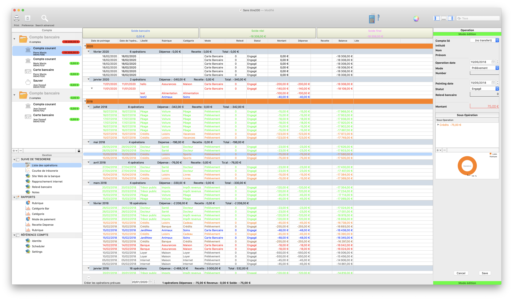
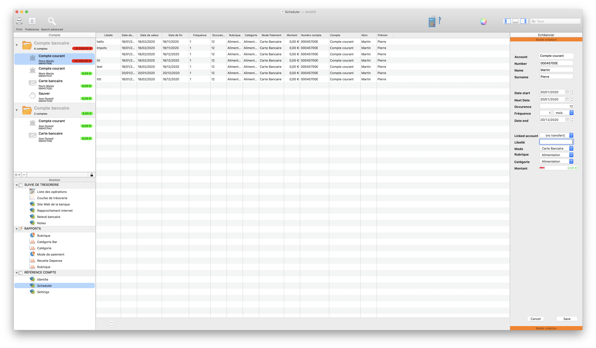
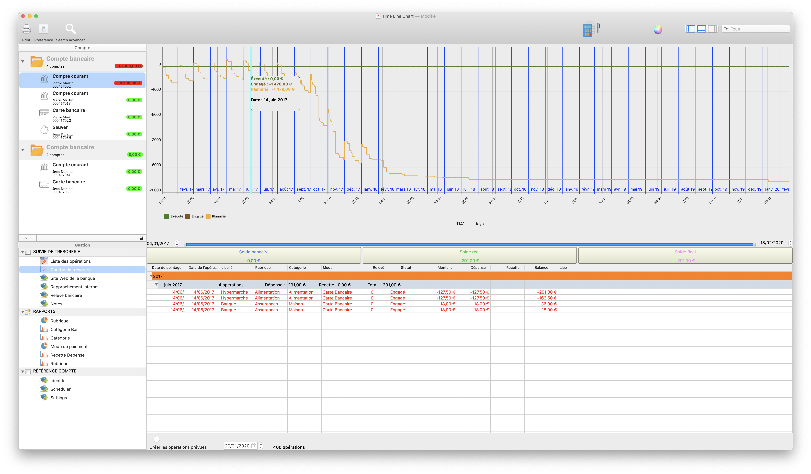
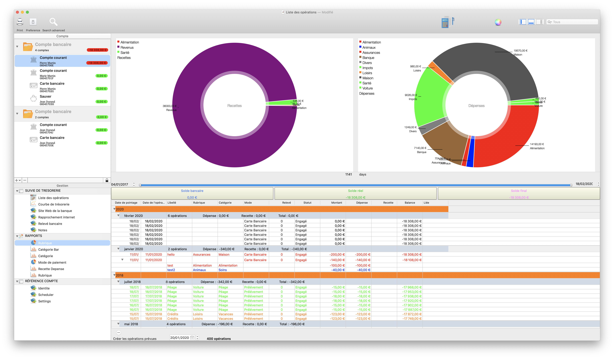
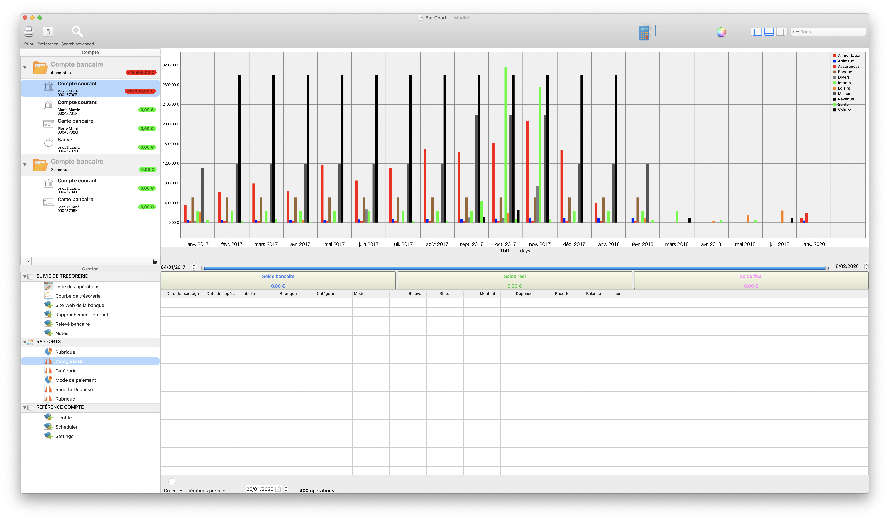
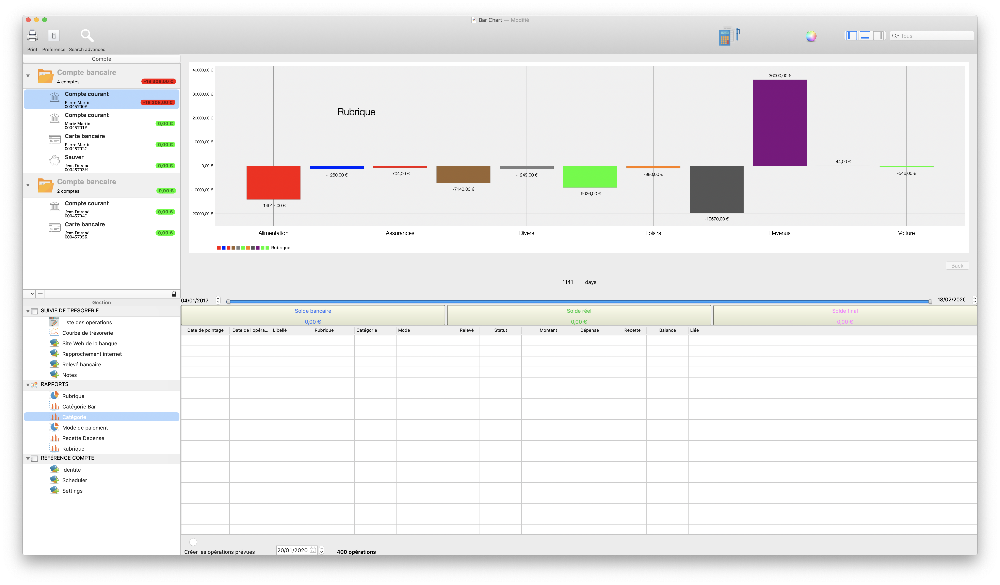
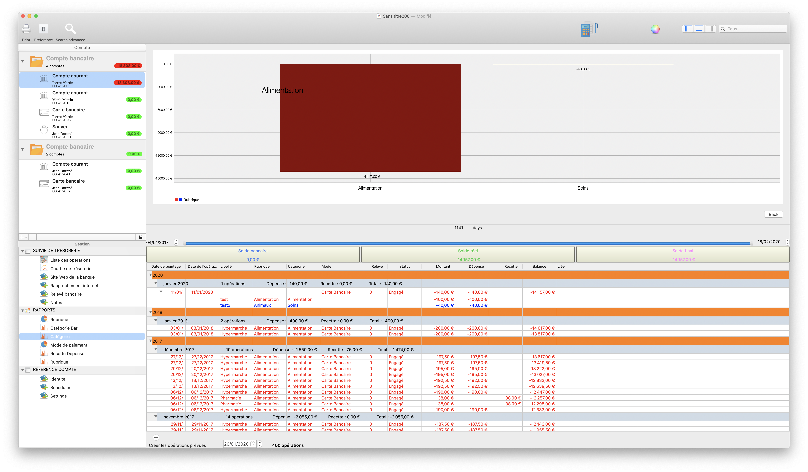
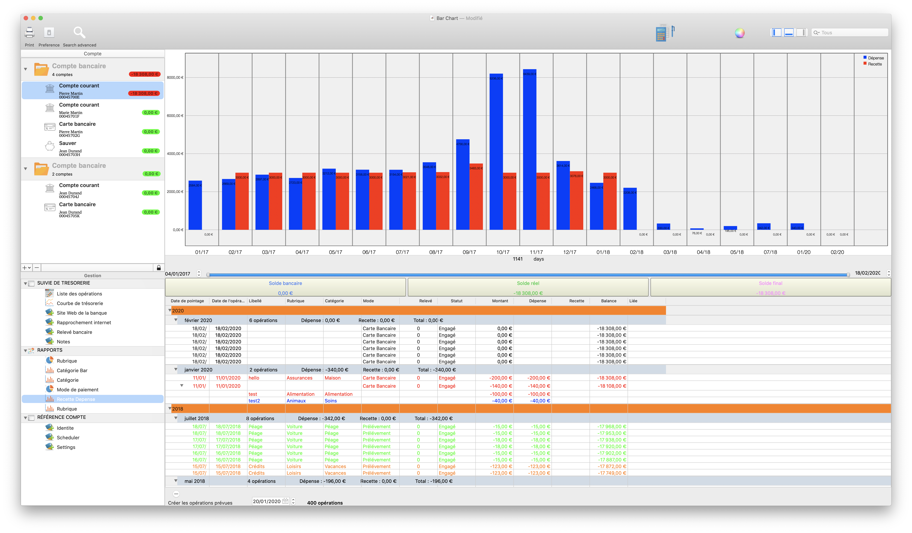

<em>Principale</em>

<em>Scheduler</em>

<em>Tresorerie</em>

<em>Tresorerie</em>

<em>Tresorerie</em>

<em>Tresorerie</em>

<em>Tresorerie</em>

<em>Tresorerie</em>

<em>Tresorerie</em>

carthage update --platform macos --use-submodules

# Personal account software

Pegase is a beautifully easy tool to keep track of your financial life on all your macOS 

#  How to manage your monthly budget well ?

Comment bien gérer son budget mensuel ?

It is necessary, in part:

Know your fixed monthly expenses (rent, transport, electricity / water, telephone, internet, etc.)

Define a budget to control expenses that vary from one month to another and this by category, examples: Entertainment and outings, Shopping, etc.

Monitor this budget monthly, correct in case of overruns or even redefine it if necessary!

Set an annual budget for trips, trips or vacations.

Trying to control yourself without depriving yourself too much and especially not buying what you don't need, because by doing so you would be risking selling what you need most.

## Carthage Install

Pegase now include Carthage

# Contributing 🙌

- If you **need help** or you'd like to **ask a general question**, open an issue.
- If you **found a bug**, open an issue.
- If you **have a feature request**, open an issue.
- If you **want to contribute**, submit a pull request.

Feel free to contribute to this project by providing ideas or opening pull requests with new features or solving an existing issue.

## Stargazers over time

$(SRCROOT)/Carthage/Build/Mac/Charts.framework
$(SRCROOT)/Carthage/Build/Mac/SwiftDate.framework

