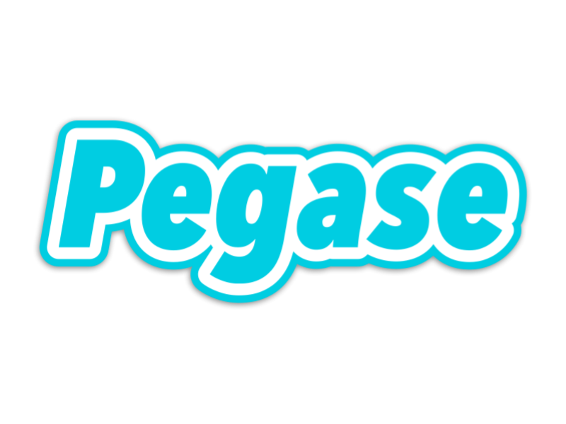
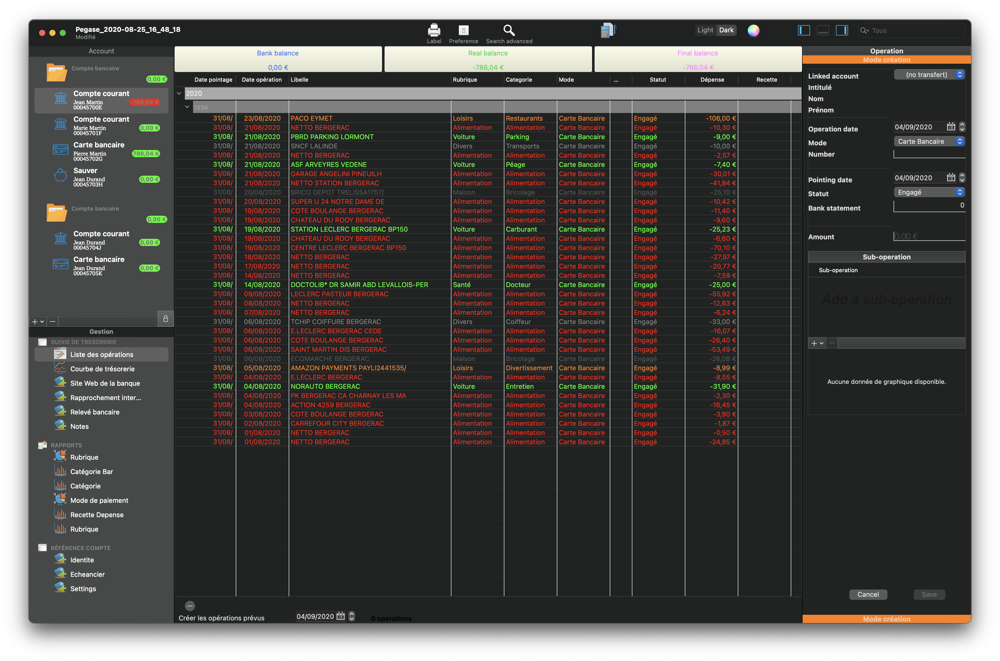
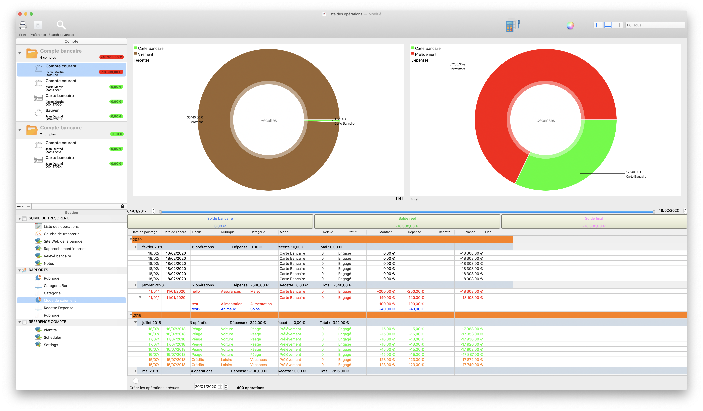

Pegase
======================

<em></em>

# 🎉 Features

 📒 Documentation

# Personal account software

Pegase is a beautifully easy tool to keep track of your financial life on all your macOS 

<em>DarkMode</em> 

---
#  How to manage your monthly budget well ?

It is necessary, in part:

Know your fixed monthly expenses (rent, transport, electricity / water, telephone, internet, etc.)

Define a budget to control expenses that vary from one month to another and this by category, examples: Entertainment and outings, Shopping, etc.

Monitor this budget monthly, correct in case of overruns or even redefine it if necessary!

Set an annual budget for trips or vacations.

Trying to control yourself without depriving yourself too much and especially not buying what you don't need, because by doing so you would be risking selling what you need most.

## Screenshots

-----

<em>Rubric Bar</em>

<em>Category Bar</em>

<em>Category Bar</em>

<em>Category</em>

<em>Tresorerie</em>

<em>Mode paiement</em>

<em>Income and expense</em>

## Compatibility

OS X 10.14 or later, 64-bit processor

---
## Installation

## CocoaPods
Pegase not include CocoaPods

## Carthage

carthage update --platform macos --use-submodules
$(SRCROOT)/Carthage/Build/Mac/Charts.framework
$(SRCROOT)/Carthage/Build/Mac/SwiftDate.framework

## Pack Manager
Pegase include pack Manager
except TFDate

## Manually
Download and drop /Sources folder in your project.
Congratulations!

You must integrate into your project manually.
- TFDate

#### What does “Pegase” mean?

[Click here.](http://letmegooglethat.com/?q=define+pegase)

# Contributing 🙌

- If you **need help** or you'd like to **ask a general question**, open an issue.
- If you **found a bug**, open an issue.
- If you **have a feature request**, open an issue.
- If you **want to contribute**, submit a pull request.

Feel free to contribute to this project by providing ideas or opening pull requests with new features or solving an existing issue.

## Acknowledgements

Thanks to everyone who helped test this software and contributed suggestions.

## Stargazers over time

